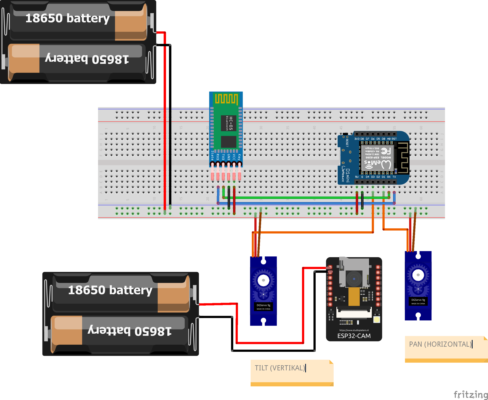

# Object Tracking with 2 Servo and ESP 32 CAM
I made a project where the camera (ESP32 cam) will follow the movement of an object using the help of 2 pan (Horizontal) and tilt (Vertical) servos. For example, when the object moves to the left, the camera will move to the left. For more information, you can watch my video : 
https://www.youtube.com/watch?v=2TU9Fy5hJ-A

Here is step by step to make this project:
1. Wiring Project

2. Upload Code to WEMOS
3. Upload Code to ESP 32 CAM
4. Run Python Code in your computer
