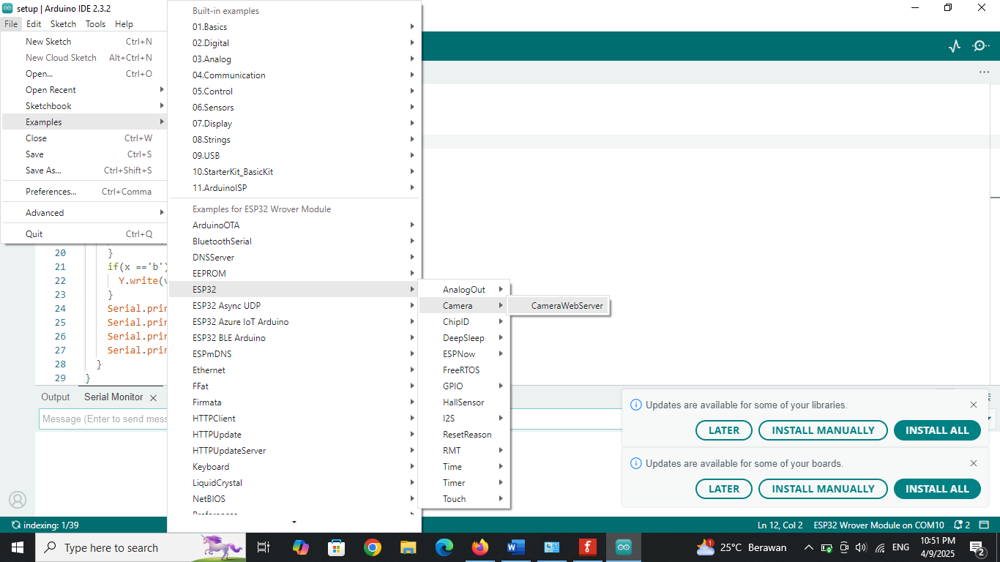

# 🎯 Object Tracking with 2 Servos and ESP32-CAM

This project uses an ESP32-CAM to track an object's movement with the help of two servos: one for **pan (horizontal)** and another for **tilt (vertical)**. For example, when the object moves to the left, the camera will also move to the left.

📺 **Watch the demo on YouTube:**  
[https://www.youtube.com/watch?v=2TU9Fy5hJ-A](https://www.youtube.com/watch?v=2TU9Fy5hJ-A)

---

## 🔧 Step-by-Step Guide

### 1. Wiring the Project


💡 **Tips:**
- Use **two separate power sources**, both 5V:
  - One for the **ESP32-CAM**
  - Another for the **servos and other electronics**

---

### 2. Upload Code to WEMOS

Upload the `arduino.txt` file to your WEMOS board.

---

### 3. Upload Code to ESP32-CAM



- Connect the ESP32-CAM to your computer
- Select the correct board in the Arduino IDE
- Use the example code from the ESP32-CAM library

---

### 4. Run Python Code on Your Computer

Run the `arduino color tracking camera.py` file.

Make sure to adjust the following:

#### ✅ Change the Camera IP:
```python
ip_cam_url = "http://192.168.220.211:81/stream"  # Replace with your ESP32-CAM's IP address
```

#### ✅ Change the Target Object Color:
```python
color = "#581845"  # Replace with your target color (HEX format)
```

#### ✅ Add Delay for Synchronization (Optional):
If you're experiencing delays between the ESP32-CAM and Bluetooth communication, add a delay like this:
```python
current_time = time.time()
if current_time - last_sent >= 0.4:  # 400 ms
    ser.write(('a' + str(int(Xposition)) + 'b' + str(int(Yposition))).encode())
    last_sent = current_time
```

---

## ⚙️ Additional Settings

- After running the program, set the **value in the top-right corner** of the Python GUI to more than `300`. Otherwise, the servos won't move.
  
---

Feel free to leave a comment on the video or repository if you have any questions or want to discuss further from my instagram: @dzakwan.pas. Happy tinkering! 🚀
